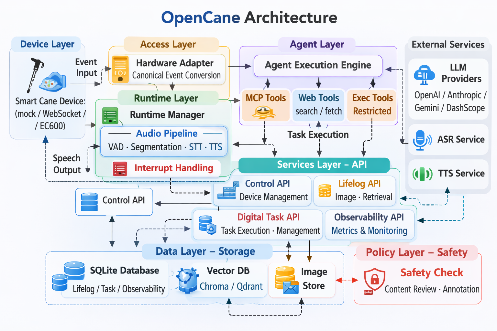

# OpenCane

[English](#english) | [简体中文](#简体中文)

## English

Language: English | [切换到简体中文](#简体中文)

OpenCane is an AI backend runtime for smart-cane scenarios, focused on an end-to-end loop:
device connectivity -> realtime conversation -> visual lifelog -> digital tasks -> safety and observability.

### Product Snapshot

- Product goal: build an OpenClaw experience for visually impaired users
- Interaction carrier: smart-cane hardware
- Human-device interaction: voice + buttons (input), voice + vibration (feedback)
- Core loop: hardware access -> realtime conversation -> visual memory -> digital tasks -> safety/observability
- Runtime form: backend service with control APIs and multi-modem adapter layer

### Architecture



### Core Capabilities

- Multi-adapter hardware ingress: `mock / websocket / ec600 / generic_mqtt`
- Multi-modem support in `generic_mqtt`: `ec600mcnle_v1 / a7670c_v1 / sim7600g_h_v1 / ec800m_v1 / ml307r_dl_v1`
- Realtime voice pipeline: segmentation, VAD, transcription, playback, and interruption
- Visual lifelog: async image ingestion, semantic retrieval, timeline retrieval, and safety annotations
- Digital task execution: create, query, cancel, offline pushback, and retry
- Control APIs: device registration/binding, operation dispatch, and runtime status queries

### Technical Highlights

- Layered architecture: `adapter / runtime / agent / api / storage / safety`
- Tool execution strategy: MCP-first with automatic fallback to `web_search / web_fetch / exec`
- Task lifecycle: `pending -> running -> success/failed/timeout/canceled`
- Persistent data layer: SQLite for lifelog, tasks, and observability
- Vector retrieval backends: `chroma` and `qdrant`
- Model provider abstraction via LiteLLM: `OpenAI / Anthropic / Gemini / DashScope` and more
- Runtime observability with realtime metrics and historical samples
- Config governance with built-in `dev/staging/prod` profiles and `config check --strict`

### Quick Start

```bash
git clone https://github.com/iflabx/opencane.git
cd opencane
pip install -e .
```

First-time initialization:

```bash
opencane onboard
```

Apply a profile (staging recommended first):

```bash
opencane config profile apply --profile CONFIG_PROFILE_STAGING.json
opencane config check --strict
```

Start hardware runtime (example):

```bash
opencane hardware serve --adapter mock --logs
```

### Documentation

- Overview: `docs/overview.md`
- Quickstart: `docs/quickstart.md`
- Architecture: `docs/architecture.md`
- Data Flow: `docs/data-flow.md`
- Hardware Runtime: `docs/hardware-runtime.md`
- Control API: `docs/api/control.md`
- Lifelog API: `docs/api/lifelog.md`
- Digital Task API: `docs/api/digital-task.md`
- Deployment & Config: `docs/deployment-config.md`
- Operations Runbook: `docs/operations-runbook.md`
- Security Baseline: `docs/security.md`
- Roadmap: `docs/roadmap.md`

### OpenCane Runtime Conventions

- Primary CLI command: `opencane`
- Python package/import path: `opencane`
- Default data directory: `~/.opencane`
- Local internal docs directory: `local-docs/`

### Acknowledgement

OpenCane is continuously evolved from an upstream open-source foundation by HKUDS.  
Thanks to HKUDS for the original engineering base.

---

## 简体中文

语言：简体中文 | [Switch to English](#english)

OpenCane 是一个面向智能盲杖场景的 AI 后端运行时，聚焦“设备接入 -> 实时对话 -> 图像记忆 -> 数字任务 -> 安全与观测”的完整闭环。

### 产品功能摘要

- 产品目标：打造“给视障人士使用的 OpenClaw”
- 交互载体：智能盲杖硬件
- 人机交互：语音 + 按钮输入，语音 + 震动反馈
- 核心闭环：设备接入 -> 实时对话 -> 图像记忆 -> 数字任务 -> 安全与观测
- 系统形态：后端运行时 + 控制 API + 多蜂窝模组适配层

### 架构图


### 核心功能

- 多硬件接入：支持 `mock / websocket / ec600 / generic_mqtt` 适配器统一接入
- 多模组适配：`generic_mqtt` 内置 `ec600mcnle_v1 / a7670c_v1 / sim7600g_h_v1 / ec800m_v1 / ml307r_dl_v1`
- 实时语音链路：支持音频分段、VAD、转写、播报与打断处理
- 视觉 Lifelog：图像异步入库、语义检索、时间线检索与安全标注
- 数字任务执行：任务创建、状态查询、取消、离线回推与重试
- 控制面 API：设备注册绑定、设备指令下发、运行状态查询

### 技术特性

- 分层架构：`adapter / runtime / agent / api / storage / safety`
- 工具执行策略：优先 MCP 工具，失败自动回退 `web_search / web_fetch / exec`
- 任务状态机：`pending -> running -> success/failed/timeout/canceled`
- 数据存储：SQLite 持久化（lifelog / task / observability）
- 向量检索：支持 `chroma` 与 `qdrant` 后端
- 提供商适配：基于 LiteLLM 统一接入 `OpenAI / Anthropic / Gemini / DashScope` 等模型
- 运维可观测：运行时指标 + 历史观测数据，支持问题复盘
- 配置治理：内置 `dev/staging/prod` 模板与 `config check --strict`

### 快速开始

```bash
git clone https://github.com/iflabx/opencane.git
cd opencane
pip install -e .
```

首次初始化：

```bash
opencane onboard
```

应用配置模板（建议先用 staging 模板）：

```bash
opencane config profile apply --profile CONFIG_PROFILE_STAGING.json
opencane config check --strict
```

启动硬件运行时（示例）：

```bash
opencane hardware serve --adapter mock --logs
```

### 文档导航

- 总览：`docs/overview.md`
- 快速开始：`docs/quickstart.md`
- 架构设计：`docs/architecture.md`
- 数据流：`docs/data-flow.md`
- 硬件运行时：`docs/hardware-runtime.md`
- 控制 API：`docs/api/control.md`
- Lifelog API：`docs/api/lifelog.md`
- Digital Task API：`docs/api/digital-task.md`
- 部署与配置：`docs/deployment-config.md`
- 运维手册：`docs/operations-runbook.md`
- 安全基线：`docs/security.md`
- 路线图：`docs/roadmap.md`

### OpenCane 运行约定

- CLI 主命令：`opencane`
- Python 包与导入路径：`opencane`
- 默认数据目录：`~/.opencane`
- 本地内部文档目录：`local-docs/`

### 致谢

本项目基于 HKUDS 的上游开源基础进行持续开发与场景化演进。  
感谢 HKUDS 团队提供的原始工程基础。
