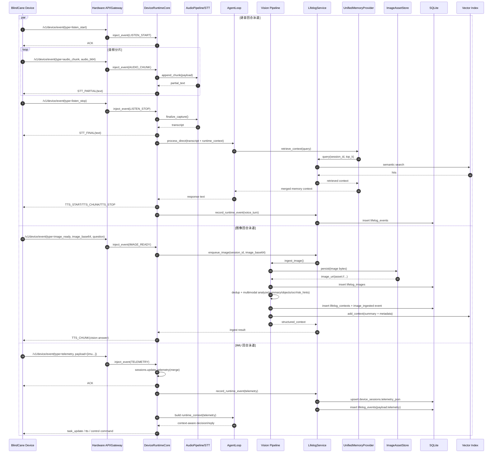

# 盲杖后端数据流时序图（三泳道）

```mermaid
sequenceDiagram
    autonumber
    participant Device as BlindCane Device
    participant API as Hardware API/Gateway
    participant Runtime as DeviceRuntimeCore
    participant Audio as AudioPipeline/STT
    participant Agent as AgentLoop
    participant Vision as Vision Pipeline
    participant Lifelog as LifelogService
    participant Memory as UnifiedMemoryProvider
    participant Asset as ImageAssetStore
    participant DB as SQLite
    participant Vec as Vector Index

    par 语音回合泳道
        Device->>API: /v1/device/event(type=listen_start)
        API->>Runtime: inject_event(LISTEN_START)
        Runtime-->>Device: ACK

        loop 音频分片
            Device->>API: /v1/device/event(type=audio_chunk, audio_b64)
            API->>Runtime: inject_event(AUDIO_CHUNK)
            Runtime->>Audio: append_chunk(payload)
            Audio-->>Runtime: partial_text
            Runtime-->>Device: STT_PARTIAL(text)
        end

        Device->>API: /v1/device/event(type=listen_stop)
        API->>Runtime: inject_event(LISTEN_STOP)
        Runtime->>Audio: finalize_capture()
        Audio-->>Runtime: transcript
        Runtime-->>Device: STT_FINAL(text)
        Runtime->>Agent: process_direct(transcript + runtime_context)
        Agent->>Memory: retrieve_context(query)
        Memory->>Lifelog: query(session_id, top_k)
        Lifelog->>Vec: semantic search
        Vec-->>Lifelog: hits
        Lifelog-->>Memory: retrieved context
        Memory-->>Agent: merged memory context
        Agent-->>Runtime: response text
        Runtime-->>Device: TTS_START/TTS_CHUNK/TTS_STOP
        Runtime->>Lifelog: record_runtime_event(voice_turn)
        Lifelog->>DB: insert lifelog_events
    and 图像回合泳道
        Device->>API: /v1/device/event(type=image_ready, image_base64, question)
        API->>Runtime: inject_event(IMAGE_READY)
        Runtime->>Lifelog: enqueue_image(session_id, image_base64)
        Lifelog->>Vision: ingest_image()
        Vision->>Asset: persist(image bytes)
        Asset-->>Vision: image_uri(asset://...)
        Vision->>DB: insert lifelog_images
        Vision->>Vision: dedup + multimodal analyze(summary/objects/ocr/risk_hints)
        Vision->>DB: insert lifelog_contexts + image_ingested event
        Vision->>Vec: add_context(summary + metadata)
        Vision-->>Lifelog: structured_context
        Lifelog-->>Runtime: ingest result
        Runtime-->>Device: TTS_CHUNK(vision answer)
    and IMU 回合泳道
        Device->>API: /v1/device/event(type=telemetry, payload={imu...})
        API->>Runtime: inject_event(TELEMETRY)
        Runtime->>Runtime: sessions.update_telemetry(merge)
        Runtime-->>Device: ACK
        Runtime->>Lifelog: record_runtime_event(telemetry)
        Lifelog->>DB: upsert device_sessions.telemetry_json
        Lifelog->>DB: insert lifelog_events(payload.telemetry)
        Runtime->>Agent: build runtime_context(telemetry)
        Agent-->>Runtime: context-aware decision/reply
        Runtime-->>Device: task_update / tts / control command
    end
```

## 备注

- IMU 当前通过 `telemetry` 泛化承载，未形成独立 IMU 专表与专索引。
- 图像链路采用“队列 + 异步 worker + 结构化上下文 + 向量检索”模式。
- 语音链路采用“分片累积 + partial/final + 长记忆检索增强”模式。

